# 自主移动机器人可视化地图规划

这个项目为世界技能大赛第48届的自主移动机器人赛项开发的可视化地图软件路线的路径规划使用，由python开发出来的前端软件，通过生成点位文件.csv格式文件，放在树莓派在通过c++读取文件地图信息，通过最短路径算法，给出一条路径的全局坐标点位信息，给到坐标使用。

python版本3.9  |  c++17版本
#### 安装：

程序包下载到本地，一键下载依赖项（推荐在win系统下使用虚拟python环境）

```
pip install -r requirements.txt
```

#### 使用pyinstaller打包成软件（可选）

```
python -m pip install -U pyinstaller
```

打包：

```
pyinstaller -w -F -i image/favicon.ico APP.py
```


## 画图程序教程

## 开头必看：

版本：2025-07-02

功能简介：为移动机器人开发的图形化手动规划路径的画图程序，本程序引用开源程序作为绘制地图的基础，用几何约束的绘制方式对用户更友好，用配套的路径规划C++程序一起使用。

##### 准备：

开源程序地址（下载其中一个即可）：
1、FreeCAD（优先）：[FreeCAD：您自己的 3D 参数化建模器](https://www.freecad.org/downloads.php)
2、LibreCAD：[LibreCAD - 免费开源 2D CAD](https://librecad.org/)

注意事项：全局的文件名不可随意更改

## 使用教程：

##### 一、地图

1、打开FreeCAD，新建一个2D草图

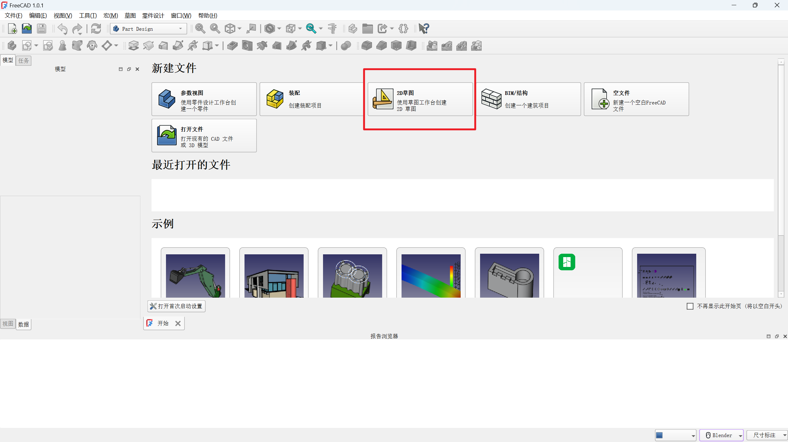

2、选择对应模式进行绘制、随便一个平面

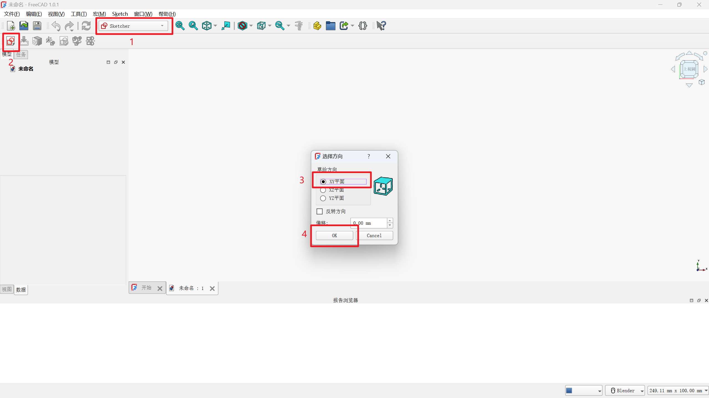

3、建立地图边框

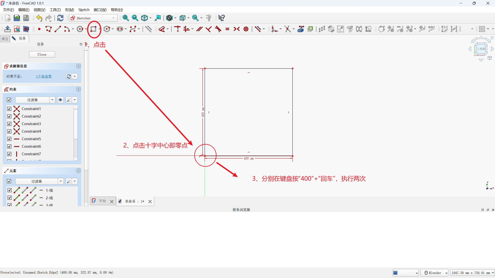

4、在地图边框中自由规划障碍物

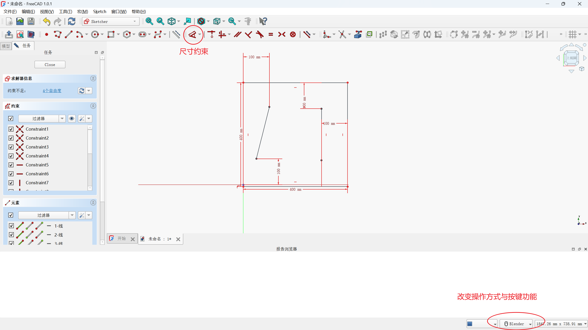

5、画好整地图后导出，**导出的文件命必须为“地图.dxf",不可更改**

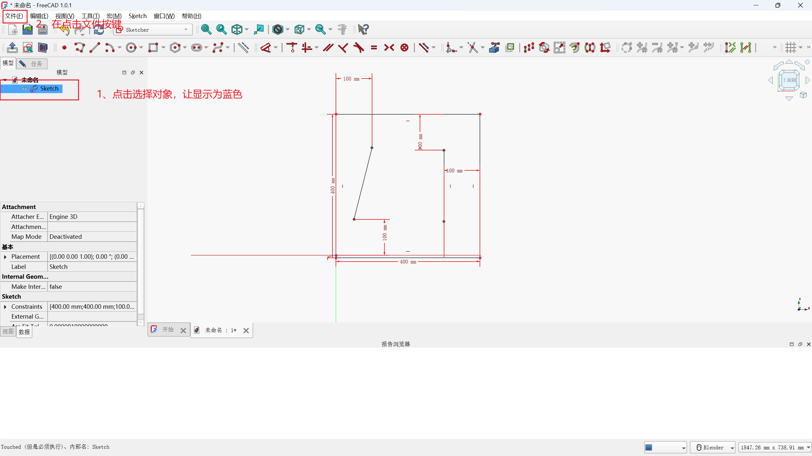

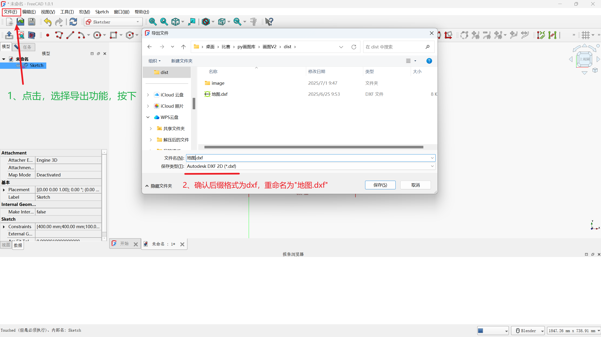

按下保存后，软件会弹出弹窗，点击保存即可

##### 二、苹果树

苹果树只需填入x、y的全局中心点与旋转角度即可

- 树点位.csv :   只能用记事本与VScode打开更改，**不可以用WPS等表格软件打开否则文件编码会乱，用不了**

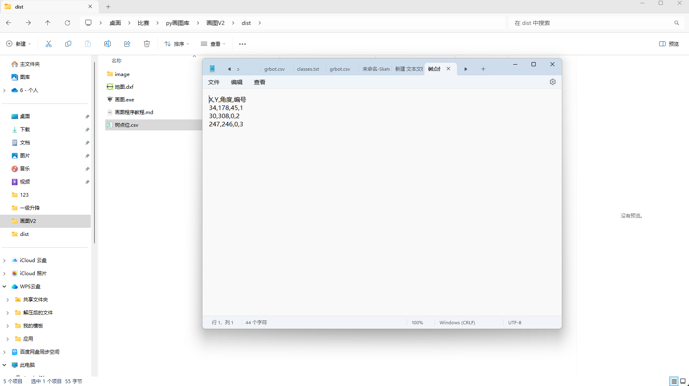

##### 三、路径规划

- 准备好了地图,dxf与树点位.csv，将两个文件放在画图.exe同一文件夹即可，打开画图.exe，前端会显示出来

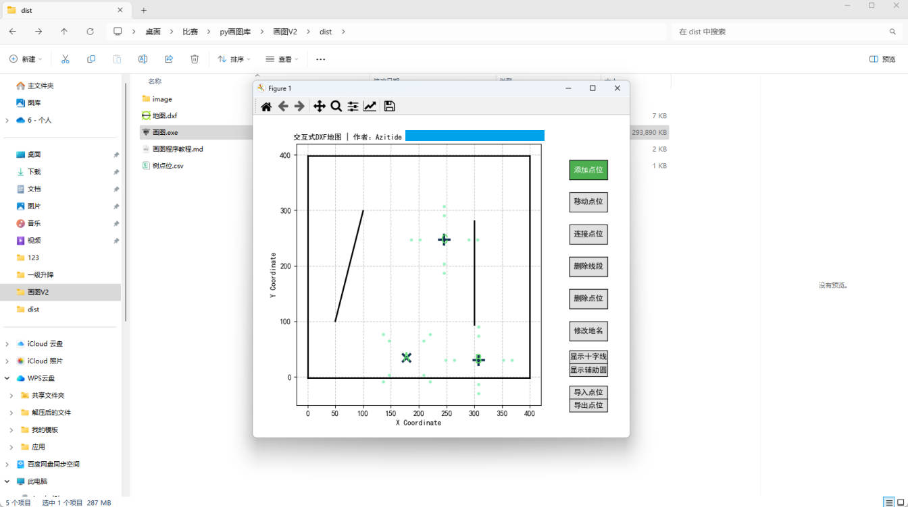

###### 功能使用：

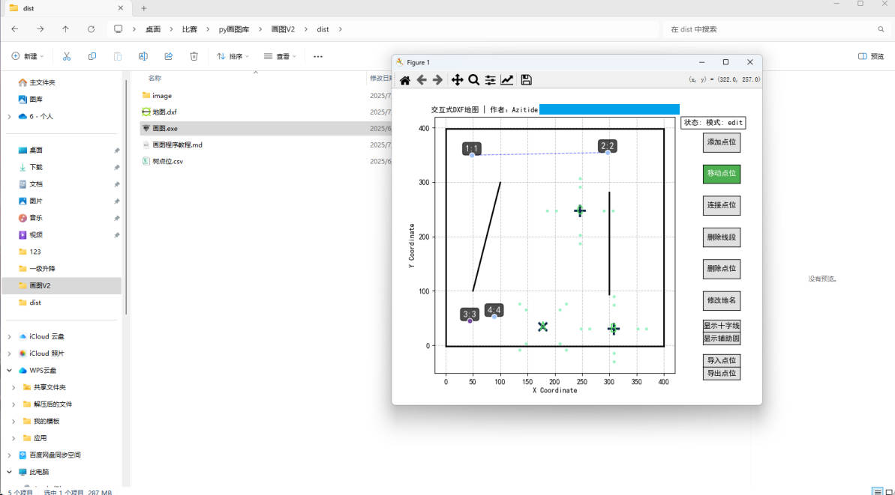

- 名词
  - 点位：移动机器人的中心点要在全局400*400要跑的位置(单位：厘米)
  - 连线：路径规划时，机器人自动判断最短的路径走到该点位

  - 地名：机器人在移动到该位置，可以根据地名判断执行对应的任务


| 功能说明                                                     |
| ------------------------------------------------------------ |
| （一）、添加点位： 在add点位模式下，单点地图400*400区域的任意位置会自动生成点位 |
| （二）、移动点位：在edit点位模式下，双击点位，使其变成紫色，是为被选中状态，随后在单击任意位置，移动到该位置 |
| （三）、连接点位：在connect点位模式下，双击点位，使其变成紫色，随后在单击其他点位，与该点位产生关系，使其连线显示 |
| （四）、删除线段：在disconnect点位模型下，单击点位之间的连线，会被删除掉 |
| （五）、删除点位：在delete点位模式下，单击点位，该点位直接被删除 |
| （六）、修改点位：在rename模型下，双击对应的点位，会弹出输入框，可以更改地名（建议在导出后的CSV文件上更改地名） |

- 辅助定位功能：

  - 十字线：地图下：定位更准


  - 辅助圆：模拟车身长度，查看并模拟碰撞距离


  - 导入点位：之前导出的CSV文件，可以导入，重新绘制点位显示	


  - 导出点位：导出的CSV文件，要给到c++配套程序的一起使用


------


## C++程序使用:

- ​     文件结构

  ```
  MyGrbot_C++
  ├─ bianyi.sh                    //脚本编译文件
  ├─ CMakeLists.txt               //编译配置文件
  ├─ src
  │  └─ main.cpp                  //示例程序
  ├─ lib
  │  └─ libGrbot.so               //grbot.hpp的实现动态库
  ├─ include 
  │  ├─ grbot.hpp                 //接口头文件
  │  ├─ csv_grbot.hpp             //csv生成地图信息存入缓存
  │  └─ grbot_ptah.hpp            //通过地图信息算出点对点的路径二维坐标容器
  ├─ data
  │  └─ points_data.csv           //数据文件::: 画图程序生成数据文件放在这个地方
  ├─ build
  └─ bin
     ├─ grbot_new.csv             //C++程序读取后再次生成的数据csv可供校对数据
     └─ MyApp                     //生成的可执行文件
  
  ```

  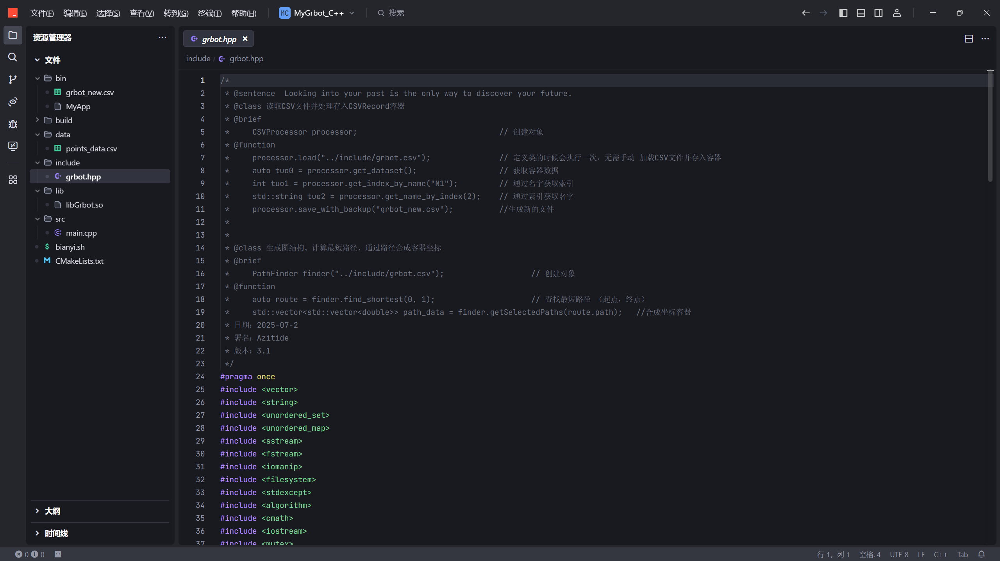


- CSV文件: 
  -  X与Y两列是支持加减法，程序是可以读取到对应的数据的
  - **数据被更改时，程序无需编译**
  - 程序只在调用load接口，程序内存数据才会被更新


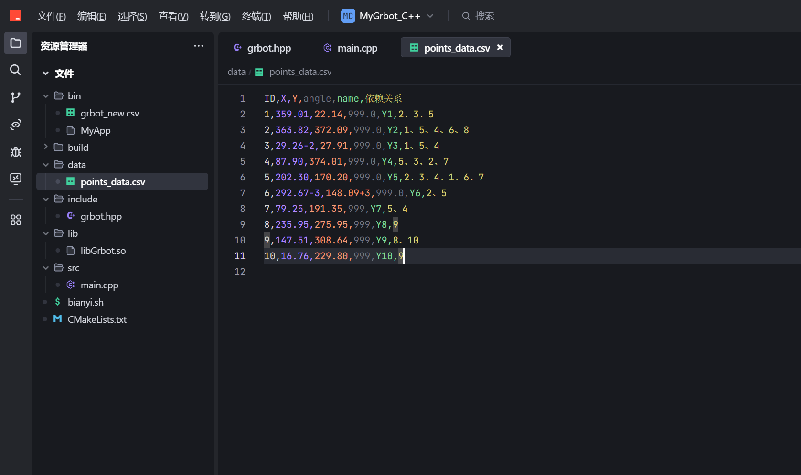

-   程序使用：（示例已有最基本的调用方法），grbot.hpp文件会有对应的接口调用说明）

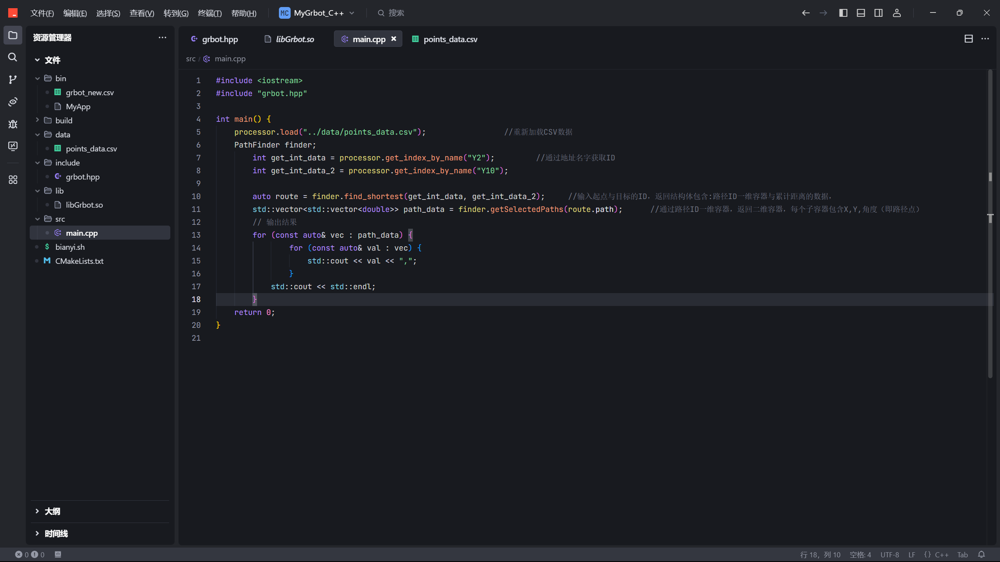


